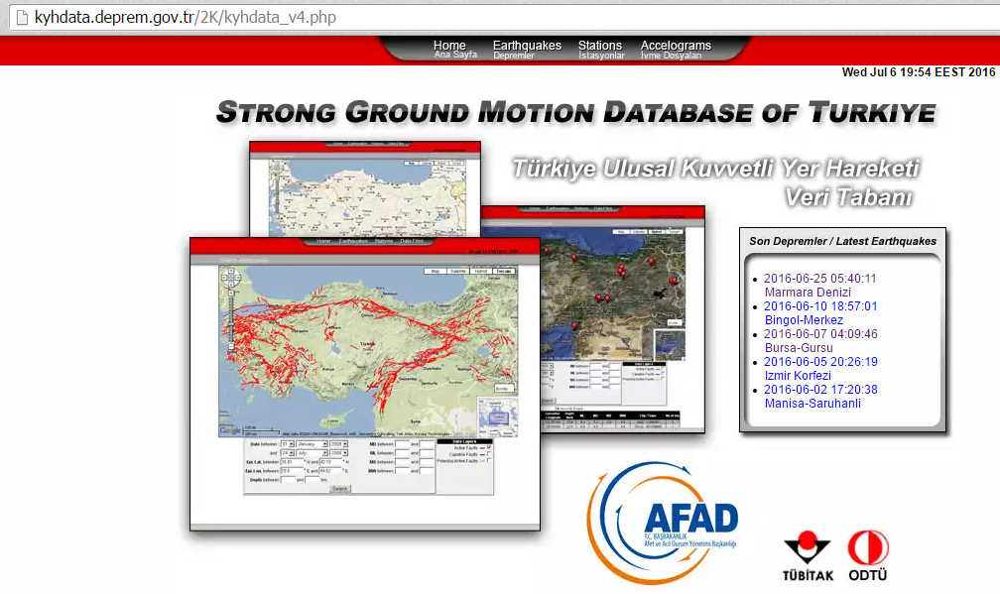

# AAD-KYH-EQE_processor

Bu programına amacı deprem.gov.tr'nin içinde yer alan Kuvvetli Yer Hareketi veri tabanına ait web sitesine giderek statik sayfa üzerinden
en son meydana gelen depremi
- belirlemek
- kayıt alan istasyonları bulmak
- elde edilen istasyon kayıtlarını görselleştirmektir. 

Bu proje açık kaynak olarak düşünülmektedir. Amacım, Jupyter notebook kullanan _Deprem Mühendisliği_ konusunda çalışan araştırmacılar için basit bir araç üretmektir. 

Dr. Ahmet Anıl Dindar

(@ahmetanildindar - ahmetanildindar@gmail.com)
